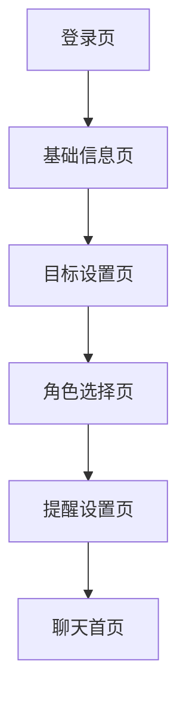

# V1 页面原型与交互说明

## 1. 全局风格

整体像微信聊天 App，但更搞笑、更有角色感。

视觉关键词：

- 轻松
- 搞笑
- 聊天感
- 女生向
- 表情包感
- 不像传统减肥工具

主界面底部 Tab：

- 聊天
- 任务
- 记录
- 我的

## 2. 首次进入流程

## 3. 登录页

### 页面目标

让用户快速进入产品，不要在登录上卡太久。

### 页面元素

- App 名称占位
- 一句副标题：找个会演的 AI 监督你减肥
- 手机号登录按钮
- 游客体验按钮
- 用户协议和隐私说明入口

### 交互

- 点击游客体验，直接进入基础信息页
- 点击手机号登录，进入验证码流程

## 4. 基础信息页

### 页面目标

收集生成减肥建议所需的最低信息。

### 页面元素

- 昵称输入
- 年龄输入
- 身高输入
- 当前体重输入
- 运动频率选择
- 饮食偏好选择
- 是否需要生理期提醒开关
- 下一步按钮

### 文案风格

不要像体检表，尽量轻松。

示例：

- “先让监督员认识一下你”
- “不用紧张，这不是班主任点名”

## 5. 目标设置页

### 页面目标

设置目标体重和期望时间。

### 页面元素

- 目标体重
- 期望完成时间
- 系统显示目标强度
- 健康提醒文案
- 下一步按钮

### 状态

目标合理：

- 显示“标准节奏，适合长期坚持”

目标过急：

- 显示“这个目标有点赶，建议放慢一点，不然容易反弹”

## 6. 角色选择页

### 页面目标

让用户选择第一位 AI 监督角色。

### 页面布局

角色卡片列表。

每张卡片包含：

- 换装吉祥物头像
- 角色名称
- 一句短描述
- 一句示例台词
- 选择按钮

### 角色卡片

皇上模式：

- 描述：让御膳房总管伺候你减肥
- 示例：启奏皇上，今日晚膳油脂略重，奴才斗胆建议饭后散步二十分钟。

奴才模式：

- 描述：让皇上亲自管你
- 示例：大胆，今日步数才三千？朕命你今晚补行两千步，再来复命。

教练模式：

- 描述：专业直接，不废话
- 示例：今天蛋白质偏低，晚餐清淡一点，饭后快走二十分钟。

霸总模式：

- 描述：冷酷但关心
- 示例：我不接受你随便放弃。今晚走二十分钟，完成后告诉我。

朋友模式：

- 描述：像微信好友一样碎碎念
- 示例：你今天这顿有点放飞，没事，晚上溜达一下补回来。

妈妈模式：

- 描述：关心但有点唠叨
- 示例：不是不让你吃，是身体也要顾着点。晚上走走，早点睡。

班主任模式：

- 描述：查作业式监督
- 示例：今日运动任务未达标，晚上补一次二十分钟快走。

## 7. 提醒设置页

### 页面目标

让用户确认提醒频率，避免后续被打扰。

### 页面元素

- 早提醒开关，默认 08:30
- 中提醒开关，默认 12:30
- 晚提醒开关，默认 20:30
- 生理期提醒开关
- 全部关闭入口
- 完成按钮

### 交互

- 点击时间可修改
- 关闭某个提醒后，该时间置灰
- 关闭全部提醒后，只保留 App 内消息

## 8. 聊天页

### 页面目标

核心首页。让用户像发微信一样记录和被监督。

### 页面结构

顶部：

- 当前角色头像
- 当前角色名称
- 切换角色入口

中间：

- 聊天气泡列表
- AI 文本消息
- AI 表情包消息
- 任务卡片消息
- 每日总结消息

底部：

- 输入框
- 表情按钮
- 快捷记录按钮
- 发送按钮

快捷记录按钮：

- 体重
- 饮食
- 运动
- 生理期

### 首次欢迎消息

皇上模式示例：

> 启奏皇上，奴才已备好记录册。从今日起，体重、膳食、运动皆由奴才替您盯着。皇上今日先报个体重？

朋友模式示例：

> 来啦来啦，从今天开始我盯着你。先别紧张，今天报个体重，我们慢慢来。

### 典型交互

用户：

> 今天 58.6kg

AI：

> 已记下。比上次轻了 0.2kg，今日开局不错。先别骄傲，午饭记得回来报备。

用户：

> 中午吃了麻辣烫

AI：

> 麻辣烫可以，但今日汤底和丸子不宜再加码。晚上清淡点，饭后走二十分钟。

AI 发送任务卡：

- 今日任务：饭后散步 20 分钟
- 按钮：完成 / 晚点 / 放弃

## 9. 任务页

### 页面目标

集中查看今日任务和完成状态。

### 页面元素

- 今日完成进度
- 任务列表
- 已完成任务
- 未完成任务
- 一键复命按钮

### 任务卡内容

- 任务名称
- 任务说明
- 截止时间
- 来源：AI 建议 / 系统提醒
- 状态按钮

### 空状态

无任务时：

> 今日暂无任务，先去聊天页报个体重，让监督员给你安排。

## 10. 记录页

### 页面目标

查看体重、饮食、运动和生理期记录。

### 页面结构

顶部：

- 本周概览
- 连续打卡天数

分区：

- 体重趋势
- 饮食记录
- 运动记录
- 生理期记录

### 体重趋势

- 折线图
- 今日体重
- 与上次相比

### 饮食记录

- 按日期展示
- 显示文本记录
- 显示 AI 标签：清淡 / 正常 / 偏油 / 偏甜 / 偏多

### 运动记录

- 步数或时长
- 是否完成任务

### 生理期记录

- 最近一次开始日期
- 预计下次提醒日期
- 温和提示

## 11. 我的页

### 页面目标

管理角色、提醒和个人设置。

### 页面元素

- 用户昵称
- 当前角色
- 切换角色
- 提醒设置
- 基础信息
- 目标设置
- 生理期提醒设置
- 隐私说明
- 退出登录

## 12. 推送提醒样例

早提醒，皇上模式：

> 启奏皇上，该晨起称重了。奴才已备好记录册。

中提醒，朋友模式：

> 午饭吃啥了？别装没看见，快来报备一下。

晚提醒，班主任模式：

> 晚间检查时间到。今日运动任务是否完成？请及时提交。

生理期提醒：

> 这几天可能快到生理期了，别太狠管自己，注意休息和保暖。

## 13. V1 原型重点

第一版原型最重要的是验证：

- 聊天页是否足够像微信
- 角色语气是否好笑
- 用户是否愿意通过聊天记录数据
- 表情包是否增强记忆点
- 任务是否能被自然接受
- 生理期提醒是否温和不冒犯

## 14. 待确认

后续还需要确认：

- App 名字
- 吉祥物具体是什么动物
- 主色调
- 表情包第一批数量
- 是否先做游客模式
- AI 回复是否需要用户手动确认后再写入记录
- 第一版是 iOS App、Android App，还是先做微信小程序 / H5 原型

## 15. V1.1 会员专业版页面补充

### 聊天页

新增快捷按钮：

- 拍照分析

交互：

- 免费用户点击后，聊天中提示这是 VIP 专业版能力，并跳转到我的页会员卡
- 会员用户点击后可上传食物照片
- 上传后生成专业分析卡片

专业分析卡片包含：

- VIP 专业分析标识
- 估算热量区间
- 真实评价
- 3 条可执行建议

示例：

- 约 620-780 kcal
- 这餐不算灾难，但偏油偏咸
- 下一餐补蛋白质和蔬菜，今晚不加奶茶，饭后散步 20 分钟

### 我的页

新增会员卡：

- VIP 专业版
- 9.9 元 / 月
- 解锁拍照估算卡路里、真实饮食评价、每餐优化建议和目标进度分析
- 开通会员按钮

新增目标体重设置：

- 目标 kg 输入框
- 调整后同步记录页曲线

### 记录页

新增：

- 目标体重卡片
- 距离目标还差多少
- 体重曲线
- 目标体重参考线
