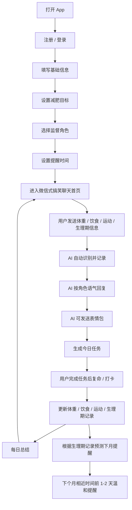

# 搞笑微信式 AI 减肥监督 App V1 PRD

## 1. 产品定位

面向女生的免费搞笑微信式 AI 减肥监督 App。

用户像发微信一样记录体重、饮食、运动和生理期，AI 根据所选角色进行监督、吐槽、提醒、鼓励，并用统一原创表情包增强趣味性。

核心一句话：

> 一个很会演、很会发表情包、每天监督你别摆烂的 AI 减肥微信好友。

## 2. 目标用户

### 2.1 核心用户

- 女生
- 想减脂、控体重、养成健康习惯
- 不喜欢传统表格型减肥 App
- 喜欢聊天、角色扮演、搞笑吐槽、轻陪伴
- 需要有人提醒，但不想接入真人监督

### 2.2 用户需求

- 希望记录体重、饮食、运动更轻松
- 希望被提醒，但不要太严肃
- 希望减肥过程有趣一点
- 希望 App 能理解自己的聊天表达
- 希望生理期期间被温和提醒，而不是被强行催运动

## 3. V1 目标

### 3.1 产品目标

- 验证用户是否愿意每天通过聊天记录减肥数据
- 验证角色扮演式监督是否提升打卡意愿
- 验证搞笑表情包和角色语气是否形成记忆点

### 3.2 不做的事情

V1 暂不做：

- 付费功能
- 真人监督
- 社区
- 饮食拍照识别
- 微信接入
- 复杂乙游剧情
- 智能硬件接入

## 4. 核心工作流



## 5. 信息架构

底部 Tab 使用 4 个：

1. 聊天
2. 任务
3. 记录
4. 我的

### 5.1 聊天

App 核心首页。

用户通过对话输入：

- 今日体重
- 饮食记录
- 运动记录
- 生理期状态
- 情绪和摆烂状态
- 任务完成情况

AI 负责：

- 识别信息类型
- 自动记录数据
- 用角色语气回复
- 发原创表情包
- 给出轻量任务
- 在必要时提醒用户不要极端减肥

### 5.2 任务

展示今日任务和完成状态。

V1 任务类型：

- 称体重
- 记录午餐或晚餐
- 饭后散步
- 步数目标
- 不加餐
- 喝水
- 睡前总结

任务完成方式：

- 点击完成
- 在聊天里说“完成了”“复命”“走完了”等

### 5.3 记录

展示四类数据：

- 体重
- 饮食
- 运动
- 生理期

V1 只做基础趋势，不做复杂分析。

### 5.4 我的

包含：

- 当前角色
- 角色切换
- 提醒设置
- 基础信息
- 减肥目标
- 隐私说明
- 退出登录

## 6. 用户首次使用流程

### 6.1 注册 / 登录

V1 可支持：

- 手机号登录
- Apple 登录
- 微信登录后续再做

若为了快速 MVP，也可以先做游客模式。

### 6.2 基础信息

必填：

- 昵称
- 年龄
- 身高
- 当前体重

选填：

- 运动频率
- 饮食偏好
- 是否爱喝奶茶
- 是否常吃夜宵
- 生理期是否需要提醒

### 6.3 减肥目标

必填：

- 目标体重
- 期望完成时间

系统自动给出目标强度：

- 轻松
- 标准
- 严格

边界规则：

- 不建议过快减重
- 不展示极端节食建议
- 目标明显不健康时给温和提醒

### 6.4 角色选择

V1 固定 7 个角色：

| 角色 | AI 身份 | 语气 |
|---|---|---|
| 皇上模式 | 奴才 / 御膳房总管 | 恭敬、夸张、劝谏 |
| 奴才模式 | 皇上 / 娘娘 / 总管 | 威严、命令、戏剧感 |
| 教练模式 | 健身教练 | 专业、直接、目标导向 |
| 霸总模式 | 冷酷监督者 | 话少、强势、冷酷但关心 |
| 朋友模式 | 微信好友 | 自然、碎碎念、轻松吐槽 |
| 妈妈模式 | 妈妈 | 关心、唠叨、生活化 |
| 班主任模式 | 班主任 | 查作业、严肃、有规矩 |

角色头像：

- 使用同一只原创动物作为吉祥物
- 不同角色换不同装扮
- 风格统一，便于后续表情包扩展

### 6.5 提醒设置

默认提醒：

| 提醒 | 默认时间 | 用途 |
|---|---:|---|
| 早提醒 | 08:30 | 称体重 / 今日目标 |
| 中提醒 | 12:30 | 午餐记录 / 饮食提醒 |
| 晚提醒 | 20:30 | 运动复命 / 晚间总结 |

规则：

- 用户可以修改时间
- 每个提醒可以单独关闭
- 也可以关闭全部提醒
- 提醒文案跟随当前角色变化

生理期提醒：

- 根据上次记录，预测下个月相近时间
- 在前 1-2 天提醒
- 语气温和
- 不催运动，不强调减重

## 7. 主要功能需求

### 7.1 聊天式记录

用户可输入自然语言。

示例：

- “今天 58.6kg”
- “中午吃了麻辣烫”
- “晚上走了 5000 步”
- “今天生理期第一天”
- “我不想动”
- “奶茶没忍住”

AI 需要识别：

- 体重
- 食物
- 运动
- 生理期
- 情绪
- 任务完成

识别后：

- 生成结构化记录
- 在聊天里确认
- 必要时补问缺失信息

### 7.2 AI 角色回复

同一个事件，不同角色有不同回复。

用户输入：

> 中午吃了炸鸡和奶茶

皇上模式：

> 启奏皇上，今日御膳略显豪横，油脂与糖分齐上阵。奴才斗胆建议晚膳清淡，饭后散步二十分钟。

奴才模式：

> 大胆，炸鸡奶茶一起上？朕命你今晚步行三十分钟，晚膳不得再放飞，回来复命。

教练模式：

> 这顿热量偏高。今晚控制加餐，安排二十到三十分钟快走，把节奏拉回来。

霸总模式：

> 吃了就认。今晚走二十分钟，别让一顿饭毁掉今天。

朋友模式：

> 哈哈哈你今天有点放飞。没事，晚上别再加餐，出去溜达一下补回来。

妈妈模式：

> 又奶茶又炸鸡呀。不是不让你吃，身体也要顾着点。晚上走走，早点睡。

班主任模式：

> 今日饮食超标，晚间需补交二十分钟快走记录。明早记得上交体重。

### 7.3 表情包系统

V1 表情包要求：

- 统一原创风格
- 同一个吉祥物不同表情
- 搞笑、夸张、微信斗图感
- 不使用网络素材

基础表情包文案：

- 朕已阅
- 御膳房震怒
- 今日不许摆烂
- 奶茶刺客出现
- 体重秤正在加载审判
- 班主任已上线
- 妈妈开始唠叨
- 教练的沉默震耳欲聋

触发场景：

- 用户吃高热量食物
- 用户完成任务
- 用户连续打卡
- 用户说不想动
- 用户忘记记录
- 用户进入生理期

### 7.4 今日任务

任务生成规则：

- 根据用户目标、当天记录和角色语气生成
- 每天任务数量控制在 2-4 个
- 生理期期间任务强度下降
- 情绪低落时优先给低门槛任务

任务示例：

- 晚饭后散步 20 分钟
- 今天不喝第二杯奶茶
- 睡前不加餐
- 晚上 20:30 前复命
- 明早称体重

### 7.5 记录和趋势

体重记录：

- 日期
- 体重
- 与上次相比
- 简单曲线

饮食记录：

- 日期
- 餐次
- 文本内容
- AI 简单判断：清淡 / 正常 / 偏油 / 偏甜 / 偏多

运动记录：

- 日期
- 类型
- 时长或步数
- 是否完成任务

生理期记录：

- 开始日期
- 结束日期，选填
- 是否提醒下次
- 下次预计提醒日期

## 8. 角色语气边界

允许：

- 搞笑
- 毒舌
- 命令
- 吐槽
- 夸张演戏

禁止：

- 羞辱身材
- 攻击长相
- 说“你没救了”等否定人格的话
- 诱导极端节食
- 鼓励催吐
- 鼓励断食
- 鼓励过量运动
- 生理期期间强行催运动

特殊场景：

- 用户情绪低落时，先安慰，再给轻任务
- 用户暴食后，不追责，先补救
- 用户体重上涨时，解释波动，不制造焦虑
- 用户生理期时，监督强度自动降低

## 9. 关键页面

V1 页面：

1. 登录页
2. 基础信息页
3. 目标设置页
4. 角色选择页
5. 提醒设置页
6. 聊天页
7. 任务页
8. 记录页
9. 我的页

## 10. 数据结构草案

### 10.1 User

- id
- nickname
- age
- height
- current_weight
- target_weight
- target_date
- role_mode
- created_at

### 10.2 ReminderSetting

- user_id
- morning_enabled
- morning_time
- noon_enabled
- noon_time
- evening_enabled
- evening_time
- period_enabled

### 10.3 ChatMessage

- id
- user_id
- sender: user / ai
- content
- message_type: text / sticker / task / summary
- created_at

### 10.4 WeightRecord

- id
- user_id
- weight
- record_date
- source_message_id

### 10.5 FoodRecord

- id
- user_id
- meal_type
- content
- ai_tag
- record_date
- source_message_id

### 10.6 ExerciseRecord

- id
- user_id
- exercise_type
- duration_minutes
- steps
- record_date
- source_message_id

### 10.7 PeriodRecord

- id
- user_id
- start_date
- end_date
- next_reminder_date
- source_message_id

### 10.8 DailyTask

- id
- user_id
- title
- description
- status: pending / done / skipped
- task_date
- created_by: ai / system

## 11. 成功指标

V1 重点看：

- 次日留存
- 7 日留存
- 每日聊天次数
- 每日记录完成率
- 任务完成率
- 角色切换率
- 提醒开启率
- 表情包触发后的用户回复率

## 12. 后续版本方向

V2 可考虑：

- 饮食拍照识别
- 更多角色
- 女友 / 男友 / 乙游模式
- 角色语音
- 周报分享图
- 付费角色包
- 真人监督
- 社区挑战
- 微信小程序版本

## 13. V1.1 会员专业版

### 13.1 定价

- 9.9 元 / 月
- 免费版保留角色聊天、文字记录、任务和基础曲线
- 会员版解锁专业分析能力

### 13.2 会员功能

1. 拍照估算食物卡路里
   - 用户上传食物照片
   - AI 识别大致食物类型、份量和烹饪方式
   - 输出热量区间，而不是单一绝对数值
   - 示例：约 450-620 kcal

2. 真实饮食评价
   - 评价要直接，但不能羞辱
   - 重点说明问题来自哪里：油脂、糖分、酱汁、主食叠加、蛋白质不足、蔬菜不足等
   - 示例：这餐不算灾难，但如果是晚餐就偏重，主要问题是油脂和酱汁叠加。

3. 可执行建议
   - 给出下一餐怎么吃
   - 给出是否需要散步
   - 不鼓励断食、催吐、过量运动
   - 示例：下一餐补蛋白质和蔬菜，今晚不加奶茶，饭后散步 20 分钟。

4. 目标体重进度
   - 用户设置目标体重
   - 记录页展示当前体重、目标体重、距离目标还差多少
   - 体重变化用曲线展示
   - 曲线中展示目标体重参考线

### 13.3 专业建议边界

- 卡路里估算必须显示为区间
- 不承诺医学级准确
- 不给极端节食建议
- 生理期、情绪低落、体重波动时降低强度
- 对暴食场景先处理情绪，再给补救方案

### 13.4 会员转化入口

V1.1 原型中的入口：

- 聊天页快捷按钮：拍照分析
- 我的页会员卡：9.9 元 / 月
- 免费用户点击拍照分析时，引导到会员卡

### 13.5 原型限制

当前 H5 原型不再硬编码卡路里结果：

- 可以上传图片
- 可以提交文字饮食记录
- 需要接入真实 AI 后端后才显示卡路里和评价
- 未配置 AI 后端时，明确提示“AI 专业分析未连接”
- 暂不接真实支付

### 13.6 推荐模型配置

会员版拍照分析推荐接入 Qwen3-VL：

- 文本分析：可用普通文本模型
- 拍照分析：必须使用视觉语言模型
- 推荐本地方案：Ollama + `qwen3-vl:8b`
- 不推荐用 `qwen3:8b` 做拍照分析，因为它不能直接识别图片

启动示例：

```powershell
ollama pull qwen3-vl:8b
$env:AI_BASE_URL="http://127.0.0.1:11434/v1"
$env:AI_API_KEY="local"
$env:AI_MODEL="qwen3-vl:8b"
node server.js
```
